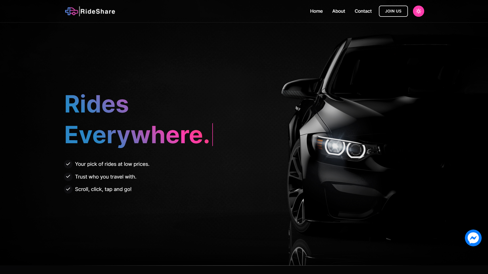
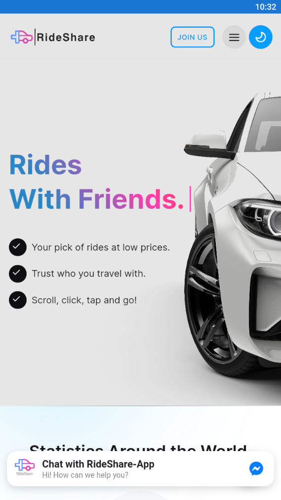
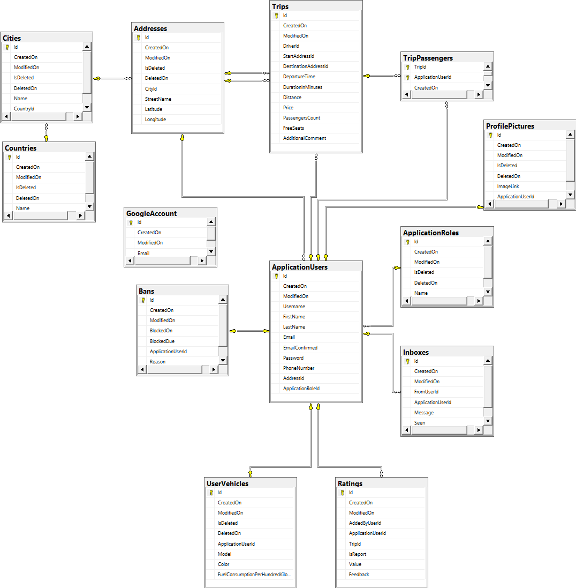

# RideShare

**Carpooling system - Share the ride** 

# 🏆 Awards
🥇 Best project for Telerik Academy C# A31 - [American Eagle](https://www.americaneagle.com/)

🥇 Best project for Telerik Academy C# A31 - [Bede Gaming](https://bedegaming.com/)

🥇 Best project for Telerik Academy C# A31 - [Mercell](https://www.negometrix.com/)

# 🖥️ Desktop



# 📱 Android



# 🧾 Project Description 
**RideShare** is a web application that enables you to share your travel from one location to other with other passengers. Every user can either organize a shared travel or request to join someone else’s travel.

# 🚪 How to install 
```diff
 To use this application you will need the following tools:
    - Visual Studio 2019 or newer
    - Microsoft SQL Server
    
+ 1. Download the project
  2. Open the .sln file
  3. Setup database migration
- 4. Go to CarPool.Common and find GlobalConstants then change the domain field to "localhost"
  5. Start the project 
```
# 🤖 How to install on Android
```diff
1. Follow the link below or download from our website
2. Open the folder you downloaded the apk file
3. Install
- Your device may need a permision to install "unverified" apps
4. Click the icon on your home screen or in the Apps menu
```

# 🔗 Links

* [Site](https://rideshare-app.azurewebsites.net/)


* [Download For Android Here](https://drive.google.com/file/d/1VsYYvLCSnAQjyMbeslrjkq9RUmD4Z7Dg/view)

# Functional Requirements 

# ⚙️ Entities 

``` 
☑️ Each user must have a username, password, first name, last name, email, and phone number.

☑️ Username must be unique and between 2 and 20 symbols.

☑️ Password must be at least 8 symbols and should contain capital letter, digit and special symbol (+, -, *, &, ^, …)

☑️ First and last names must be between 2 and 20 symbols.

☑️ Email must be valid email and unique in the system.

☑️ Phone number must be 10 digits and unique in the system. 

☑️ Each travel must have a starting and ending points, departure time, number of free spots and, optional comment (e.g. no smoking/luggage)
 ```

# 📢 Public Part 
```diff
☑️  The public part _must_ be accessible without authentication i.e., for anonymous users.

☑️ Anonymous users must be able to register and login. Registration of a new user should use email verification flow.

☑️ Anonymous users must see detailed information about Carpooling and its features as well as how many people are using the platform and how many travels have happened.

☑️ Anonymous users should be able to see list of the top 10 travel organizers and top 10 passengers.
```
# 🔒 Private part
```
☑️ Accessible only if the user is authenticated.

☑️ Users must be able to login/logout, update their profile, set a profile photo/avatar.

☑️ Each user must be able to create a new travel that he is planning.

☑️ Each user must be able to browse the available trips created by other users with an option to sort and filter them. List with trips should support pagination.

☑️ Each user must be able to apply for a trip as a passenger. The driver can approve/decline passengers from the candidates’ pool. After approval from the driver, passenger still can cancel his participation and driver still can reject a passenger.

☑️ The driver must be able to cancel a trip before the departure time. He also must be able to mark the trip as complete.

☑️ When the trip is complete the passengers must be able to leave feedback about the driver as well as the driver must be able to leave feedback for every passenger. Feedback must include numeric rating (from 0 to 5) and optional text comment.

☑️ Each user must be able to view all his travels (with option to filter and sort them), all his feedback and all feedback for any other user. List with travels/feedback should support pagination.
```
# 👨‍💻 Administrative part
```
☑️ Accessible to users with administrative privileges.

☑️ Admin users must be able to see list of all users and search them by phone number, username or email and block or unblock them. A blocked user must not be able to create travels and apply for travels. List with users should support pagination.

☑️ Admin users must be able to view a list of all travels with option to filter and sort them. List with travels should support pagination.
```

# REST API 
To provide other developers with your service, you need to develop a REST API. It should leverage HTTP as a transport protocol and clear text JSON for the request and response payloads.

A great API is nothing without a great documentation. The documentation holds the information that is required to successfully consume and integrate with an API. You must use Swagger to document yours.

The REST API provides the following capabilities:

1. Users

* CRUD operations (must)

* Block/unblock user (must)

* Search by username, email, or phone (must)

2. Travels

* CRUD operations (must)

* Apply for a travel (must)

* List and manage (approve/reject) applicants (must)

* Filter and sort travels (must)

# 📈 Database Diagram


# 🎯 Swagger 
* [Swagger](https://ride-shareapi.azurewebsites.net/swagger/index.html)

# ⚙️ Technical Requirements 
1. General 
* Follow OOP principles when coding 
* Follow KISS, SOLID, DRY principles when coding 
* Follow REST API design best practices when designing the REST API (see 
Appendix) 
* Use tiered project structure (separate the application in layers) 
* The service layer (i.e., "business" functionality) must have at least 80% unit 
test code coverage 
* Follow BDD when writing unit tests 
* You should implement proper exception handling and propagation 
* Try to think ahead. When developing something, think – “How hard would it 
be to change/modify this later?”
2. Database 
> The data of the application must be stored in a relational database. You need to identify the core domain objects and model their relationships accordingly. Database structure should avoid data duplication and empty data (normalize your database).

Your repository must include two scripts – one to create the database and one to fill it with data. 

3. Git 
> Commits in the GitLab repository should give a good overview of how the project 
was developed, which features were created first and the people who contributed. 
Contributions from all team members must be evident through the git commit 
history! The repository must contain the complete application source code and any 
scripts (database scripts, for example). 
Provide a link to a GitLab repository with the following information in the 
README.md file: 
* Project description 
* Link to the Swagger documentation (must)
* Link to the hosted project (if hosted online) 
* Instructions how to setup and run the project locally 
* Images of the database relations (must)

## 🏁 Areas
* Public - users are able to register(or use forgot password option), see top users list, chat with bot and send contact emails
* Private - available after registration, can edit profile, can create and join trip, can manage trips, can see profiles, can chat with other users, can leave feedback
* Administrative - available for administrators only, can review reports and ban users

## 👷 Built with:
* ASP .NET Core
* MsSQL Server
* Entity Framework
* Swagger
* Azure hosting
* SignalR chats(private and global)
* Android Xamarin 👽
* Mail Service
* Auto unban background service
* JWT for API / Cookies for WEB
* Sensitive data BCrypt
* Google Auth - Google profiles
* Bing API
* ImageKitAPI
* Facebook Chat Bot
* Moq testing
* Javascript/jQuery/AJAX
* HTML5/CSS/Bootstrap/SweetAlert/Animate.css
* HTML Scrapper

## 🤝 Authors

* Georgi Petrov [GitHub](https://github.com/Turnikman88) | [LinkedIn](https://www.linkedin.com/in/georgi-petrov-88a259225/)


* Kalin Balimezov [GitHub](https://github.com/balimka) | [LinkedIn](https://linkedin.com/in/kalin-balimezov-6755a8204)


## 📃 License
*This project was developed for educational purposes  __only__ during Telerik Academy Program C# 31 (Jul - Dec 2021)*

## 🤖 Project status
☑️ **DONE** 
